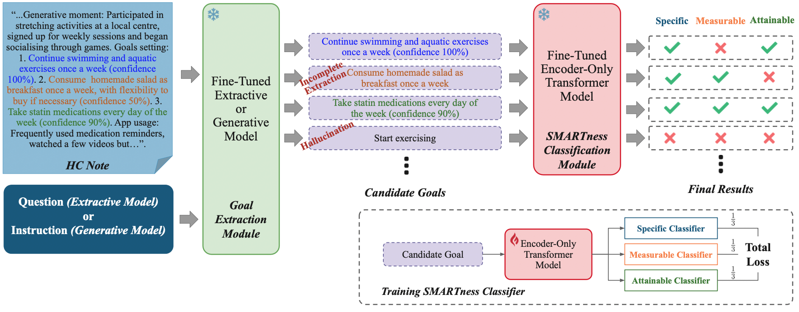

# SMARTMiner

SMARTMiner is a two-stage framework for multi-span behavioral goal extraction from unstructured health coaching (HC) notes. 

<div align="center">
  
  <br/>
  <sup><b>Figure 1.</b> SMARTMiner: a span-based goal extractor followed by a SMARTness classification module.</sup>
</div>

## Goal Extraction module (SpanQualifier)

The Goal Extraction module casts goal identification as **span-based QA**: a **SpanQualifier** head on top of **DeBERTa-v3-base** returns **multiple goal spans** directly from each HC note.  

### Recommended fine-tuning: continue from MultiSpanQA → SMARTSpan

Two-stage fine-tuning—start from the MultiSpanQA-tuned checkpoint, then continue on SMARTSpan for best extraction accuracy:

```bash
python SpanQualifier.py \
  --dataset_dir ../SMARTSpan --split split_1 \
  --model_name microsoft/deberta-v3-base \
  --tokenizer_name microsoft/deberta-v3-base \
  --init_checkpoint True \
  --hf_repo_id_fine_tuned ivabojic/deberta-v3-base_MultiSpanQA
```

### Fine-tuning from base model (no prior MultiSpanQA fine-tuning)

Run SpanQualifier directly from DeBERTa-v3-base on SMARTSpan:

```bash
python SpanQualifier.py \
  --dataset_dir ../SMARTSpan --split split_1 \
  --model_name microsoft/deberta-v3-base \
  --tokenizer_name microsoft/deberta-v3-base \
  --init_checkpoint False
```

### Example (HC note → extracted goals)

**Input**
```json
{
  "id": "8",
  "question": ["what","are","the","smart","goals","mentioned","in","the","text","?"],
  "context": ["smart","goal",":","follow","myhealthy","plate","three","times","a","week",".",
              "wellness","vision",":","to","be","healthy","and","able","to","walk","in","nature",".",
              "three-month","goals",":","to","reduce","ldl","cholesterol","levels","through","a",
              "healthy","diet","and","regular","exercise","."],
  "num_span": 1,
  "label": ["O","O","O","B","I","I","I","I","I","I","O","O","O","O","O","O","O","O","O","O",
            "O","O","O","O","O","O","O","O","O","O","O","O","O","O","O","O","O","O","O"]
}
```

**Output**
```json
{
  "id": "8",
  "extracted_goals": ["follow myhealthy plate three times a week"]
}
```

## SMARTness Classification (S/M/A)

A lightweight classifier that scores each extracted goal on three dimensions—Specific, Measurable, Attainable (S/M/A)—and deterministically maps to: SMART (S=1, M=1, A=1), Partially SMART (exactly two of S/M/A are 1), Not SMART (one or none are 1).

### Recommended fine-tuning:

```bash
python SMARTClassifier.py \
  --dataset_dir ../SMARTSpan \
  --split split_1 \
  --model_name microsoft/deberta-v3-large \
  --max_len 64 \
  --batch_size 4 \
  --epochs 20 \
  --lr 2e-5
```

### Example (extracted goal → SMARTness classification)

**Input**
```json
{
  "id": "8",
  "extracted_goals": ["follow myhealthy plate three times a week"]
}
```

**Output**
```json
{
  "id": "8",
  "extracted_goal": "follow myhealthy plate three times a week",
  "predicted": "Partially SMART",
  "SMA_pred": [1, 1, 0]
}
```

## SMARTMiner framework

Runs SMARTMiner end-to-end on a split: it loads your SpanQualifier checkpoint to extract multiple goal spans from HC notes, then loads the SMARTClassifier to score S/M/A and map each span to SMART / Partially SMART / Not SMART.

```bash
python SMARTMiner.py \
  --gpu 0 \
  --dataset_dir ../SMARTSpan --split split_1 \
  --results_dir ../results --output_dir ../outputs \
  \
  --extract_model_name microsoft/deberta-v3-base \
  --extract_lr 3e-5 --extract_bs 32 --extract_as 4 \
  --extract_max_len 512 --dim2 64 --max_span_gap 47 \
  \
  --classify_model_name microsoft/deberta-v3-large \
  --classify_lr 2e-5 --classify_bs 4 --classify_max_len 64 \
  --seed 30
```
